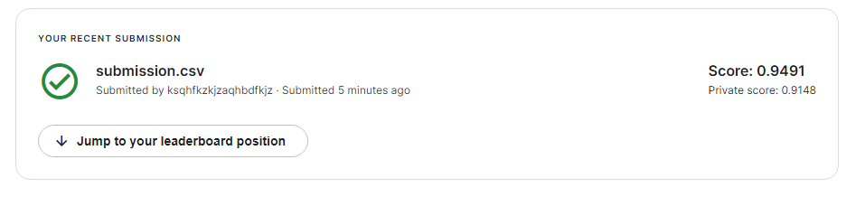

### Dataset description

A positive label indicates that the center 32x32px region of a patch contains at least one pixel of tumor tissue. Tumor tissue in the outer region of the patch does not influence the label. This outer region is provided to enable fully-convolutional models that do not use zero-padding, to ensure consistent behavior when applied to a whole-slide image.

The original PCam dataset contains duplicate images due to its probabilistic sampling, however, the version presented on Kaggle does not contain duplicates. We have otherwise maintained the same data and splits as the PCam benchmark.

### Tasks

- Load the dataset ✔️
- Prepare the dataset ✔️
- Create and train the models ✔️
- Analyze statistical results (confusion matrix, ROC curve, AUC, F1-score, ...) ✔️
- [Feature maps visualization](https://towardsdatascience.com/convolutional-neural-network-feature-map-and-filter-visualization-f75012a5a49c) ❌
- Test the models and create a submission file for kaggle ✔️
- Hyperparameter tuning ✔️
- [Transfer Learning](https://towardsdatascience.com/how-to-get-top-1-on-kaggle-and-help-with-histopathologic-cancer-detection-af729dc3e6f7) ❌
- Frontend ✔️
- Use tensorflowjs w/o memory leaks ✔️
- Deploy second model w/ gh-pages ✔️
- Code refactoring ❌
- Test on different datasets ✔️
- Make a powerpoint presentation ✔️

### Kaggle submission

### Test scores on different datasets w/ model 2

|             |     Class 1    |     Class 0    |
|:----------- | :------------: | :------------: |
| [Breast](https://www.kaggle.com/datasets/paultimothymooney/breast-histopathology-images)          | 9/10 |  8/10 |
| [Lung](https://www.kaggle.com/datasets/andrewmvd/lung-and-colon-cancer-histopathological-images)  | 9/10 | 10/10 |
| [Colon](https://www.kaggle.com/datasets/andrewmvd/lung-and-colon-cancer-histopathological-images) | 6/10 |  3/10 |
